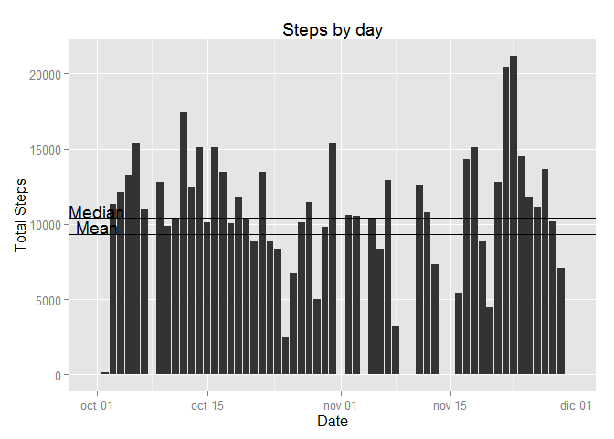
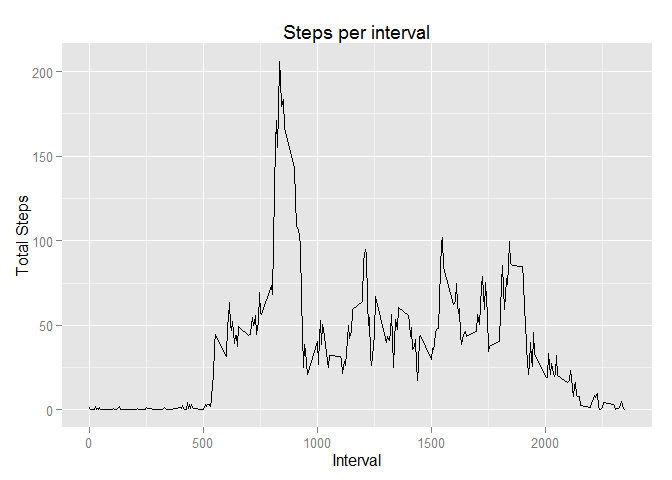
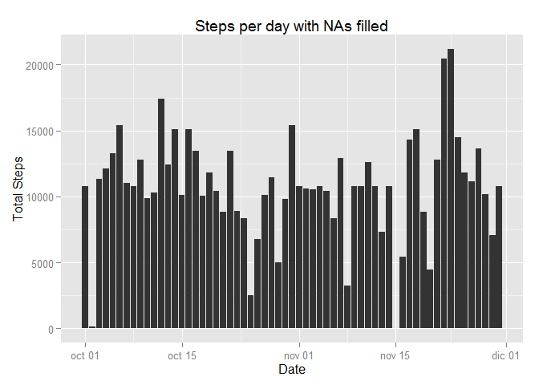

# Reproducible Research: Peer Assessment 1


## Loading and preprocessing the data

First I load the dplyr and ggplot2 libraries


```r
library(dplyr)
```

```
## 
## Attaching package: 'dplyr'
## 
## The following objects are masked from 'package:stats':
## 
##     filter, lag
## 
## The following objects are masked from 'package:base':
## 
##     intersect, setdiff, setequal, union
```

```r
library(ggplot2)
```

Then I Load the csv file ubicated in my work directory, later I give the right 
format to Date column


```r
activity <- read.csv("activity.csv", stringsAsFactors = F)
activity$date <- as.Date(activity$date)
```


## What is mean total number of steps taken per day?

I use dply to calculate the total steps per day later I plot the histogram and 
calculate the mean and median.


```r
Activity_Day <- activity %>% group_by(date) %>% 
        summarize(steps = sum(steps, na.rm = T))

Activity_Mean <- mean(Activity_Day$steps, na.rm = T)
Activity_Median <- median(Activity_Day$steps, na.rm = T)

ggplot(Activity_Day, aes(x = date, y = steps)) + 
        geom_histogram(stat = "identity", bindwith = 1) +
        geom_hline(yintercept = Activity_Mean) + 
        annotate("text", min(Activity_Day$date), Activity_Mean + 500, 
                 label = "Mean") + 
        geom_hline(yintercept = Activity_Median) + 
        annotate("text", min(Activity_Day$date), Activity_Median + 500, 
                 label = "Median") + 
        xlab("Date") + ylab("Total Steps") + ggtitle("Steps by day")
```

 

The mean of total steps is 9354.2295082 and the median is 
10395

## What is the average daily activity pattern?

I calculate the mean steps per interval later I plot the line representing it


```r
Activity_Interval <- activity %>% group_by(interval) %>% 
        summarize(meansteps = mean(steps, na.rm = T))

ggplot(Activity_Interval, aes(x = interval, y = meansteps)) + 
        geom_line(stat = "identity") +
        xlab("Interval") + ylab("Total Steps") + ggtitle("Steps per interval")
```

 

## Imputing missing values

Calculate the total of NAs values


```r
Null_values <- sum(is.na(activity))
```

The total of NAs value is 2304.

Then I filled the NAs using a new dataframe: new_activity.


```r
new_activity <- merge(activity, Activity_Interval, by="interval")

new_activity[is.na(new_activity$steps), 2] <- new_activity[is.na(new_activity$steps), 4]

Activity_Day2 <- new_activity %>% group_by(date) %>% 
        summarize(steps = sum(steps, na.rm = T))

Activity_Mean2 <- mean(Activity_Day2$steps, na.rm = T)
Activity_Median2 <- median(Activity_Day2$steps, na.rm = T)

ggplot(Activity_Day2, aes(x = date, y = steps)) + 
        geom_histogram(stat = "identity", bindwith = 1) + 
        xlab("Date") + ylab("Total Steps") + 
        ggtitle("Steps per day with NAs filled")
```

 

The mean of total steps is 1.0766189\times 10^{4} and the median is 
1.0766189\times 10^{4} with NAs filled

## Are there differences in activity patterns between weekdays and weekends?
