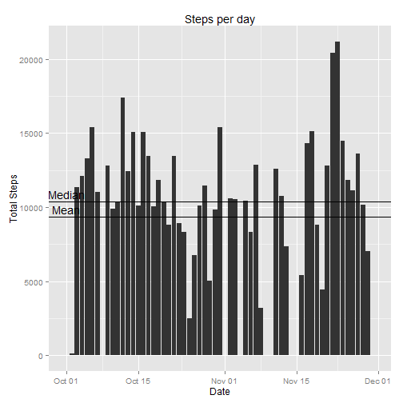
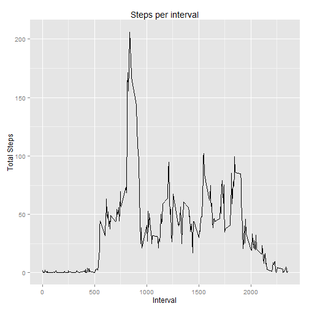
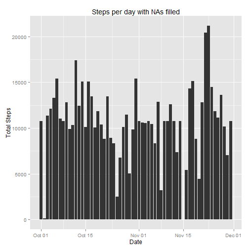

## Loading and preprocessing the data

First I load the **dplyr** and **ggplot2** libraries.


```r
library(dplyr)
library(ggplot2)
```

Then I load the csv file ubicated in my work directory, later I give the right 
format to Date column.


```r
activity <- read.csv("activity.csv", stringsAsFactors = F)
activity$date <- as.Date(activity$date)
```


## What is mean total number of steps taken per day?

I use dply to calculate the total steps per day later I plot the histogram and 
calculate the mean and median.


```r
Activity_Day <- activity %>% group_by(date) %>% 
        summarize(steps = sum(steps, na.rm = T))

Activity_Mean <- mean(Activity_Day$steps, na.rm = T)
Activity_Median <- median(Activity_Day$steps, na.rm = T)

ggplot(Activity_Day, aes(x = date, y = steps)) + 
        geom_histogram(stat = "identity", bindwith = 1) +
        geom_hline(yintercept = Activity_Mean) + 
        annotate("text", min(Activity_Day$date), Activity_Mean + 500, 
                 label = "Mean") + 
        geom_hline(yintercept = Activity_Median) + 
        annotate("text", min(Activity_Day$date), Activity_Median + 500, 
                 label = "Median") + 
        xlab("Date") + ylab("Total Steps") + ggtitle("Steps per day")
```

 

The mean of total steps is 9354.2295082 and the median is 
10395.

## What is the average daily activity pattern?

I calculate the mean steps per interval later I plot the line representing it.


```r
Activity_Interval <- activity %>% group_by(interval) %>% 
        summarize(meansteps = mean(steps, na.rm = T))

ggplot(Activity_Interval, aes(x = interval, y = meansteps)) + 
        geom_line(stat = "identity") +
        xlab("Interval") + ylab("Total Steps") + ggtitle("Steps per interval")
```

 

I obtain the interval with the max number of steps.


```r
max_value <- max(Activity_Interval$meansteps)
max_interval <- Activity_Interval[Activity_Interval$meansteps == 
                                          max(Activity_Interval$meansteps), 1]
max_hour <- max_interval%/%100
max_minute <- max_interval%%100
```

The interval with the max value is 835 with the value of 
206.1698113. The interval represent the time: 8:35.

## Imputing missing values

Calculate the total of NAs values.


```r
Null_values <- sum(is.na(activity))
```

The total of NAs value is 2304.

Then I filled the NAs using a new dataframe: **new_activity**. The strategy 
that I use for filled the NAs is taking the mean steps per interval and put 
them in place of NAs.


```r
new_activity <- merge(activity, Activity_Interval, by="interval")

new_activity[is.na(new_activity$steps), 2] <- 
        new_activity[is.na(new_activity$steps), 4]

Activity_Day2 <- new_activity %>% group_by(date) %>% 
        summarize(steps = sum(steps, na.rm = T))

Activity_Mean2 <- mean(Activity_Day2$steps, na.rm = T)
Activity_Median2 <- median(Activity_Day2$steps, na.rm = T)

ggplot(Activity_Day2, aes(x = date, y = steps)) + 
        geom_histogram(stat = "identity", bindwith = 1) + 
        xlab("Date") + ylab("Total Steps") + 
        ggtitle("Steps per day with NAs filled")
```

 

The mean of total steps is 1.0766189 &times; 10<sup>4</sup> and the median is 
1.0766189 &times; 10<sup>4</sup> with NAs filled. The new values are different from the 
first exercise, is not a great difference but they converge now, the histogram 
has changes in the days with NAs values but they are minimun.

## Are there differences in activity patterns between weekdays and weekends?

First of all, I create a new variable **typeday** to classified days as weekday 
or weekend.


```r
Sys.setlocale("LC_ALL","English")
```

```
## [1] "LC_COLLATE=English_United States.1252;LC_CTYPE=English_United States.1252;LC_MONETARY=English_United States.1252;LC_NUMERIC=C;LC_TIME=English_United States.1252"
```

```r
new_activity <- new_activity %>% mutate(weekday = weekdays(date))
new_activity <- new_activity %>% mutate(typeday = grepl("^S", weekday))
new_activity$typeday <- gsub('TRUE', 'weekend', new_activity$typeday)
new_activity$typeday <- gsub('FALSE', 'weekday', new_activity$typeday)
new_activity$typeday <- as.factor(new_activity$typeday)
Activity_Interval_TypeDay <- new_activity %>% group_by(interval, typeday) %>% 
        summarize(meansteps = mean(steps, na.rm = T))
```

Then I use lattice library for create the plot.


```r
library(lattice)
xyplot(meansteps ~ interval | typeday, data = Activity_Interval_TypeDay, 
       type = "l", layout = c(1, 2), xlab = "Interval", 
       ylab = "Number of steps")
```

 

The graphic show us that there isn't many differences in activity patterns 
between weekdays and weekends.
